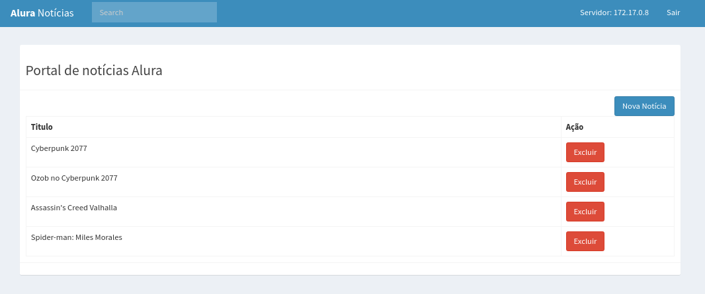

# alura-k8s


Repositório com arquivos de manifesto criados durante o curso de k8s da Alura.

## Abordagens
- Pods
- Services
- Deployments
- Replicaset
- Configmaps
- HPA
- Probes

## Preparando o ambiente
``` shell
# Baixando e instalando o minikube
curl -LO https://storage.googleapis.com/minikube/releases/latest/minikube-linux-amd64
sudo install minikube-linux-amd64 /usr/local/bin/minikube

# Baixando e instalando o kubectl
curl -LO "https://storage.googleapis.com/kubernetes-release/release/$(curl -s https://storage.googleapis.com/kubernetes-release/release/stable.txt)/bin/linux/amd64/kubectl"
chmod +x ./kubectl
sudo mv ./kubectl /usr/local/bin/kubectl

# Subindo cluster k8s via minikube
minikube start
kubectl get nodes
```

## Subindo o App
``` shell
kubectl apply -f .

## Acesse o IP mostrado na saída abaixo
## PORTA 30000 --> Portal de Notícias
## PORTA 30001 --> Sistema de Notícias
kubectl get node -o wide | egrep -o "192(\.[0-9]{1,3}){3}"

## User: admin
## Pass: admin
```
## Portal de Notícias


## Sistema de Notícias

